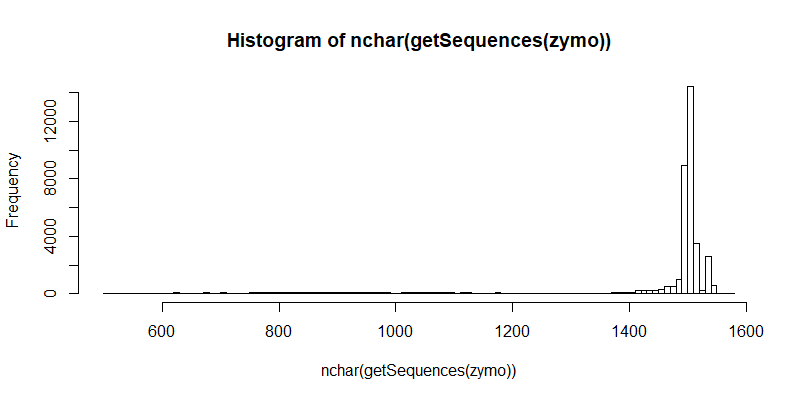
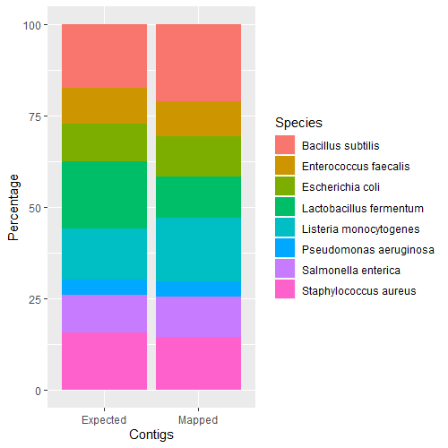
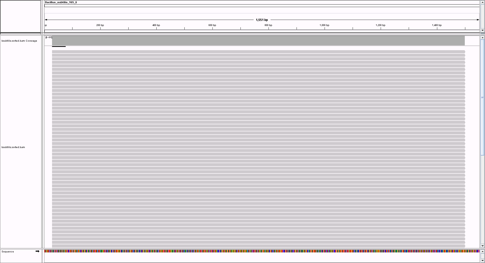
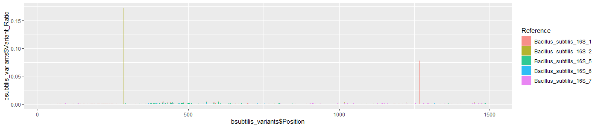
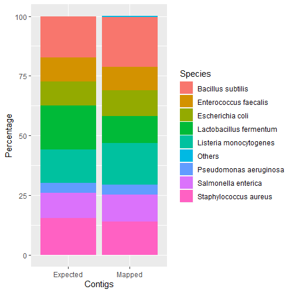
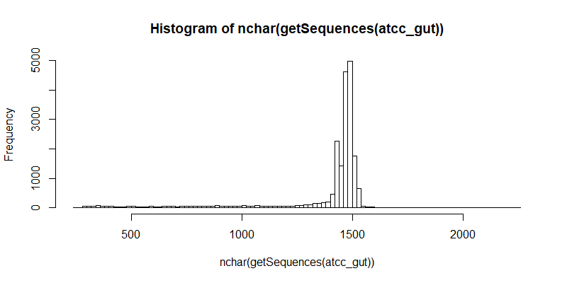
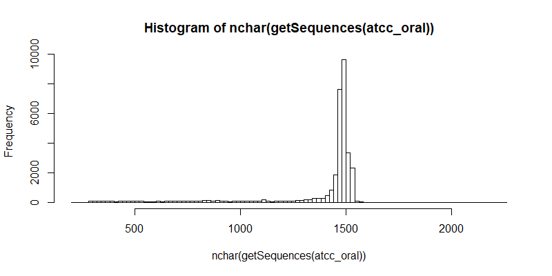
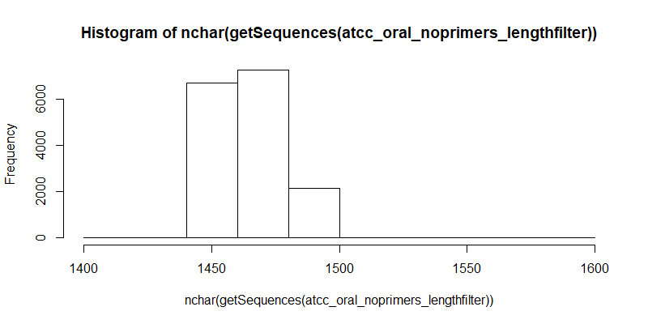
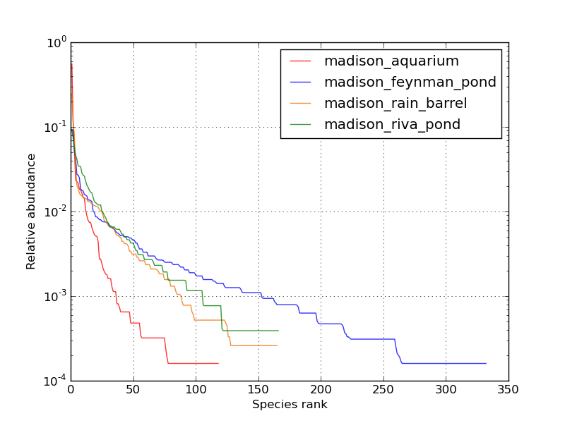
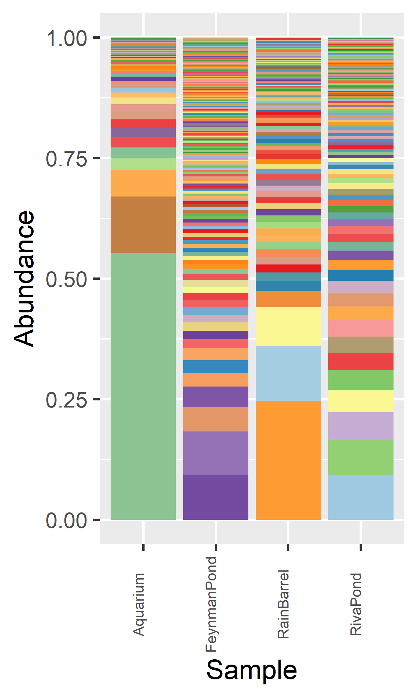

# Analysis for LoopSeq 16S manuscript

### [Zymo Mock Community Analysis](https://github.com/nico-chung/loopseq#zymo-mock-community-analysis-1)

### [ATCC Mock Human Communities Analysis](https://github.com/nico-chung/loopseq#atcc-mock-human-communities-analysis-1)

### [Madison Water Samples Analysis](https://github.com/nico-chung/loopseq#madison-water-samples-analysis-1)

&nbsp; 

### Computing Environment 

#### R 
- R v3.6.1
- Bioconductor v3.10
- DADA2 v1.14.0 
- ShortRead v1.44.0
- ggplot2 v3.2.1

#### CentOS6 Linux
- Bowtie v2.2.9
- samtools v1.3.1
- Alfred v0.1.17
- Kraken v2.0.8-beta
- Bracken v2.5
- trimmomatic v0.36
- FLASH v1.2.11
- cutadapt v1.16

&nbsp; 

---

# Zymo Mock Community Analysis 

The Zymo mock community was analyzed using three methods:
- [Mapping LoopSeq 16S contigs and Illumina V3V4 short reads to provided references](https://github.com/nico-chung/loopseq/blob/master/README.md#mapping-to-provided-references)
- [Mapping LoopSeq 16S contigs to NCBI RefSeq references](https://github.com/nico-chung/loopseq/blob/master/README.md#mapping-to-ncbi-refseq-references)
- [Classifying LoopSeq 16S contigs with LCA classifier](https://github.com/nico-chung/loopseq/blob/master/README.md#classification-with-lca-classifier)


## Data Preparation

### Mock Community Description

The ZymoBIOMICS Microbial Community DNA Standard is composed of ten microbial species: eight bacteria and two fungi, the latter two of which were not amplified by the LoopSeq 16S rRNA primers used. Genomic DNA quantity from the eight species are evenly distributed and vary in Gram stain, genome size, GC content, 16S copy number and phylogenetic relatedness. 

| **Species** | **16S copies** | **Expected contig %** |
|---------|------------|-------------------|
Bacillus subtilis |	10 |	17.4
Enterococcus faecalis	| 4 | 9.9
Escherichia coli | 7	| 10.1
Lactobacillus fermentum	| 5 |	18.4
Listeria monocytogenes	| 6 |	14.1
Pseudomonas aeruginosa	| 4 |	4.2
Salmonella enterica	| 7 |	10.4
Staphylococcus aureus | 6 |	15.5


### LoopSeq 16S Contig QC & Filtering

Load fastq file containing raw contigs as downloaded from the Loop Genomics cloud platform.

[Raw contigs fastq file](https://github.com/nico-chung/loopseq/raw/master/data/zymo.rar)

```
#R
library(dada2)
library(ShortRead)

F_prim <- "AGAGTTTGATCMTGGCTCAG" #forward primer
R_prim <- "TACCTTGTTACGACTT" #reverse primer

zymo <- file.path("zymo.fastq")

#Basic statistics of raw contigs
summary(nchar(getSequences(zymo)))
   Min. 1st Qu.  Median    Mean 3rd Qu.    Max. 
    500    1494    1508    1430    1510    1572 

#Distribution of raw contigs
hist(nchar(getSequences(zymo)), 100) 
```


```
#Remove forward and reverse primers. This step also ensures that the contigs that remain after filtering are the full length 16S gene. 
removePrimers(zymo, paste0("zymo_noprimers.fastq"), primer.fwd=F_prim, primer.rev=rc(R_prim), compress=FALSE, max.mismatch=2, allow.indels=FALSE, verbose=TRUE)
Read in 38629, output 27123 (70.2%) filtered sequences.

#Basic statistics of filtered contigs (full length 16S, primers trimmed) 
summary(nchar(getSequences(zymo_noprimers)))
   Min. 1st Qu.  Median    Mean 3rd Qu.    Max. 
   1426    1464    1472    1474    1474    1509 

#Distribution of filtered contigs (full length 16S, primers trimmed)
zymo_noprimers <- file.path("zymo_noprimers.fastq")
hist(nchar(getSequences(zymo_noprimers)), 10) 
```
[Filtered contigs fastq file](https://github.com/nico-chung/loopseq/raw/master/data/zymo_noprimers.rar)

 


## Mapping to Provided References

Zymo replaced five strains in the Zymo standard with similar strains beginning with Lot ZRC190633. [The sample we sequenced was from LOT NUMBER ###]. As has been noted elsewhere (Callahan Benjamin C., et al. "High-throughput amplicon sequencing of the full-length 16S rRNA gene with single-nucleotide resolution", *Nucleic Acids Research*, 47.18 (2019): e103), the exact strains used are not disclosed and the [reference sequences](https://s3.amazonaws.com/zymo-files/BioPool/ZymoBIOMICS.STD.refseq.v2.zip) provided by Zymo Research do not exactly correspond to the strains provided. There are two versions of the references: version 1 and version 2. In both versions, there are systematic nucleotide substitutions that cannot be explained by sequencing or contig assembly error. The references include whole genomes and 16S genes only. In version 1 of the references, the whole genome references are in multiple contigs and in the 16S gene references, only one 16S copy is given for each species. Version 2 of references aren’t correct either but is still more correct than version 1. The new version has complete whole genome references and all 16S gene copies are given for each species. 

Concatenate all bacterial whole genome fasta files together and build a Bowtie2 index with version 2 of the whole genome references and map the filtered Zymo contigs. 

```
cat *.fasta > zymo_bacteria_genome_ref.fasta

bowtie2-build zymo_bacteria_genome_ref.fasta zymo_bacteria_genome_ref

bowtie2 --very-sensitive -p 40 --un zymo.un.fastq -x zymo_bacteria_genome_ref/zymo_bacteria_genome_ref -q zymo_noprimers.fastq -S zymo.sam
27123 reads; of these:
  27123 (100.00%) were unpaired; of these:
    0 (0.00%) aligned 0 times
    0 (0.00%) aligned exactly 1 time
    27123 (100.00%) aligned >1 times
100.00% overall alignment rate 
```

Many of the 16S genes are highly similar/identical and multiple valid alignments may occur. Even though the provided reference sequences are incorrect, given that the contigs are full-length 16S sequences and the contigs are accurate enough, all eight bacterial species are sufficiently phylogenetically distant that the multiple mappings occur within a single genome reference. It is the case generally that accurate full-length 16S sequences are able to discriminate between species (Johnson, Jethro S., et al. "Evaluation of 16S rRNA gene sequencing for species and strain-level microbiome analysis." *Nature communications* 10.1 (2019): 1-11.). There are exceptions (eg. Mycobacterium genus) where inter-species 16S copies are so similar (~99.9%), that with even minor sequence errors, it may be difficult to unambiguously map the sequences to the correct references.

```
#Extract names of hits and count number of each unique hit
samtools view -F 4 zymo.sam | cut -f3 | sort | uniq -c

   5692 BS.pilon.polished.v3.ST170922
   2627 Enterococcus_faecalis_complete_genome
   2962 Escherichia_coli_chromosome
   3066 Lactobacillus_fermentum_complete_genome
   4722 Listeria_monocytogenes_complete_genome
   1151 Pseudomonas_aeruginosa_complete_genome
   3032 Salmonella_enterica_complete_genome
   3871 Staphylococcus_aureus_chromosome

```

| **Species** | **Expected contig %** | **Mapped contig %** |
|-------------|-----------------------|---------------------|
Bacillus subtilis | 17.4 |	21.0
Enterococcus faecalis | 9.9 | 9.7
Escherichia coli | 10.1 | 10.9
Lactobacillus fermentum | 18.4 | 11.3
Listeria monocytogenes | 14.1 | 17.4
Pseudomonas aeruginosa | 4.2 | 4.2
Salmonella enterica | 10.4 | 11.2
Staphylococcus aureus | 15.5 | 14.3

Species ratios are as expected. 

```
#R
library(ggplot2)
zymo <- read.table("zymo_exp_vs_map.txt", header=TRUE, sep="\t")
ggplot(zymo, aes(fill=Species, y=Percentage, x=Contigs)) + geom_bar(position="stack", stat="identity")
```
 


### Intergenomic 16S Gene Copies & Contig Accuracy

*B. subtilis* has the most 16S gene copies (ten) of the species in the Zymo standard so it can provide a fine-grain view of relative intergenomic 16S gene ratios. It also appears to be one of the correct references for the strain provided (no systematic mismatches between contig and reference) so it would allow for an unbiased assessment of LoopSeq contig accuracy.   

Extract the full length 16S contigs that orginally mapped to *B. subtilis*.
```
samtools view zymo.sam | cut -f1,3 | awk -F "\t" '{ if($2 == "BS.pilon.polished.v3.ST170922") { print $1}}' > bsubtilis_contigs_list
seqtk subseq zymo_noprimers.fastq bsubtilis_contigs_list > bsubtilis_contigs.fastq
```
Sequences for each of the ten 16S genes is given in the reference fasta file. [Multiple sequence alignment](data/zymo_bsubtilis_clustal_msa.txt) shows that there are five non-redundant copies . Copy #1, #4, #8, #9, #10 are identical. #2, #3 are identical. #5, #6, #7 are all unique. To prevent multi-mapping, build a bowtie2 index only using #1, #2, #5, #6, #7. Thus a mapping ratio of 5:2:1:1:1 is expected.  
```
bowtie2 --very-sensitive -p 40 --un bsubtilis_contigs_trimmed.un.fastq -x zymo_bsubtilis_ref/Bacillus_subtilis_16S_nr -q bsubtilis_contigs.fastq -S bsubtilis.sam
5692 reads; of these:
  5692 (100.00%) were unpaired; of these:
    0 (0.00%) aligned 0 times
    0 (0.00%) aligned exactly 1 time
    5692 (100.00%) aligned >1 times
100.00% overall alignment rate #all mapped to 16S copies

#Extract reference hits
samtools view -F 4 bsubtilis.sam | cut -f3 | sort | uniq -c > bsubtilis_hits_counts

   2466 Bacillus_subtilis_16S_1
   1482 Bacillus_subtilis_16S_2
    604 Bacillus_subtilis_16S_5
    617 Bacillus_subtilis_16S_6
    523 Bacillus_subtilis_16S_7
    
```


| **16S Gene Copy** | **Expected contig %** | **Mapped contig %** |
|-------------------|-----------------------|---------------------|
Bacillus_subtilis_16S_1 | 50 | 43.3
Bacillus_subtilis_16S_2	| 20 | 26
Bacillus_subtilis_16S_5	| 10 | 10.6
Bacillus_subtilis_16S_6	| 10 | 10.8
Bacillus_subtilis_16S_7	| 10 | 9.1

Intergenomic 16S gene ratios are as expected.

```
zymo_bsubtilis <- read.table("zymo_bsubtilis_16S_copies.txt", header=TRUE, sep="\t")
ggplot(zymo_bsubtilis, aes(fill=Contigs, y=Percentage, x=Gene.Copy)) + 
  geom_bar(position="dodge", stat="identity") + 
  theme(axis.text.x = element_text(angle = 45, hjust = 1))
```


Visually inspect the alignments to check if there is anything unusual about the alignments. Sort and index the SAM file and load in IGV.
```
samtools view -b -S bsubtilis.sam | samtools sort -o bsubtilis.sorted.bam - && samtools index bsubtilis.sorted.bam
```
**Bacillus_subtilis_16S_1**


**Bacillus_subtilis_16S_2**


**Bacillus_subtilis_16S_5**


**Bacillus_subtilis_16S_6**


**Bacillus_subtilis_16S_7**


Quantify the quality of the alignments in Alfred. 

```
alfred qc -r zymo_bsubtilis_ref/Bacillus_subtilis_16S_nr.fasta -o alignment_qc.tsv.gz bsubtilis.sorted.bam
zgrep ^ME alignment_qc.tsv.gz | cut -f 2- | datamash transpose | column -t > zymo_bsubtilis_16S_alignment_qc.tsv
```
[Result file](data/zymo_bsubtilis_16S_alignment_qc.tsv)

##### QC Summary
- MatchRate                       0.999798
- MismatchRate                    0.000201824
- DeletionRate                    2.38704e-06
- InsertionRate                   2.14834e-06

The error rates are extremely low considering these contigs have only been filtered to cover the full-length of the 16S gene. They have not been quality filtered, denoised or any other type of algorithmic error correction. Indels are negligible. Since consensus sequence accuracy is contigent on read depth, higher per base accuracy and a higher proportion of full-length 16S contigs can be expected with increased sequencing yield. But since there is a limited number of UMI barcodes per 16S fragment, there will be an upper limit to gains in accuracy. 

Examine the distribution of mismatch errors in the contigs. Use a custom script to quantify the position and frequencies of variants.
```
samtools mpileup -B -L 1 -Q 0 -F 0 -f zymo_bsubtilis_ref/Bacillus_subtilis_16S_nr.fasta bsubtilis.sorted.bam > bsubtilis.pileup
pileup2SNVbaseCounts.pl -i bsubtilis.pileup -snvDepth 0 -indelDepth 0

```
[Result file](data/zymo_bsubtilis_mpileup_baseCount.csv)

The five non-redundant copies of the 16S gene are the same length, so they can be overlapped on the same plot. Only base mismatches are shown since there are practically no indels to visualize. 
```
#R
bsubtilis_variants <- read.csv("zymo_bsubtilis_mpileup_baseCount.csv",header=TRUE)
ggplot(data=bsubtilis_variants,aes(x=bsubtilis_variants$Position,fill=Reference,y=bsubtilis_variants$Variant_Ratio)) + geom_bar(stat="identity")
```


Mismatch errors are randomly distributed. The mismatches at the two peaks (gene copy #2 at pos: 285 [G->A] and gene copy #1 pos: 268 [G->A]) likely represent real variants since they are too high to be explained by sequencing or assembly error: the sequencing library consists of short randomly fragmented segments of the 16S gene. Consequently, the true mismatch error rate may be even lower: the bases in the two peaks combined accounts for 454/1691 total mismatch errors.


### Comparison with Illumina Short Paired-End Reads

Short read 16S barcoding studies frequently sequence the V3V4 hypervariable region in 300bp paired-end mode. These paired-end reads are then filtered, trimmed and merged into ~440bp fragments which are then used for denoising and/or OTU clustering and classification. To make a fair comparison with LoopSeq contigs, the short reads are processed in a way as might be seen in a typical 16S barcoding study. The denoising step is omitted because it would potentially produce error-free reads; as would be the case if LoopSeq contigs were to undergo denoising. This would not permit a meaningful comparison of accuracies between the two methodologies.

The fastq files are too large to host on Github so have not been provided.

```
#Check how many pairs of reads in raw fastq file
echo $(zcat zymo-v3v4_R1.fastq.gz|wc -l)/4|bc
3278936

#Map against the PhiX reference to remove spike-in sequences
bowtie2 -p 24 --un-conc zymo-v3v4.fastq -x phiX/phiX -1 zymo-v3v4_R1.fastq.gz -2 zymo-v3v4_R2.fastq.gz -S zymo-v3v4_phiX.sam

#Filter out reads with low average quality and clip low quality bases in the tails
java -jar trimmomatic-0.36.jar PE zymo-v3v4.1.fastq.gz zymo-v3v4.2.fastq.gz zymo-3V4_clean_1.fastq.gz zymo-v3v4_unclean_1.fastq.gz zymo-v3v4_clean_2.fastq.gz zymo-v3v4_unclean_2.fastq.gz AVGQUAL:20
java -jar trimmomatic-0.36.jar PE zymo-v3v4_clean_1.fastq.gz zymo-v3v4_clean_2.fastq.gz zymo-v3v4_good_1.fastq.gz zymo-v3v4_bad_1.fastq.gz zymo-v3v4_good_2.fastq.gz zymo-v3v4_bad_2.fastq.gz TRAILING:20 

#Merge reads
flash -t 24 -m 20 -M 250 -d merged -o zymo-v3v4 zymo-v3v4_good_1.fastq.gz zymo-v3v4_good_2.fastq.gz 

#Trim V3V4 primers. 3’ primer sequence needs to be given in the reverse complement.
cutadapt -e 0.05 -g CCTACGGGNGGCWGCAG -a GGATTAGATACCCBDGTAGT -o zymo-v3v4.noprimers.fastq zymo-v3v4.extendedFrags.fastq --discard-untrimmed --no-indels
```

Check merged read distribution.
```
#R
zymo_v3V4_noprimers <- file.path("zymo-v3v4.noprimers.fastq")
summary(nchar(getSequences(zymo_v3V4_noprimers)))
   Min. 1st Qu.  Median    Mean 3rd Qu.    Max. 
   17.0   444.0   444.0   444.1   444.0   574.0 
   
#Some merged reads are too short/long to be correct so these need to be filtered out
fastqFilter(zymo_v3V4_noprimers, "zymo-v3v4_noprimers_length.fastq", minLen=440, maxLen=450, verbose=TRUE, compress=FALSE)
Read in 2761523, output 2239559 (81.1%) filtered sequences.

```

```
#Map to Zymo whole genome bacteria references
bowtie2 --very-sensitive -p 40 --un zymo-v3v4.un.fastq -x zymo_bacteria_genome_ref/zymo_bacteria_genome_ref -q zymo-v3v4_noprimers_length.fastq -S zymo-v3v4.sam
2239559 reads; of these:
  2239559 (100.00%) were unpaired; of these:
    2051 (0.09%) aligned 0 times
    51 (0.00%) aligned exactly 1 time
    2237457 (99.91%) aligned >1 times
99.91% overall alignment rate

#Extract names of hits and count number of each unique hit
samtools view -F 4 zymo-v3v4.sam | cut -f3 | sort | uniq -c
 348730 BS.pilon.polished.v3.ST170922
 202215 Enterococcus_faecalis_complete_genome
 266642 Escherichia_coli_chromosome
 351894 Lactobacillus_fermentum_complete_genome
 282619 Listeria_monocytogenes_complete_genome
 177842 Pseudomonas_aeruginosa_complete_genome
 268401 Salmonella_enterica_complete_genome
 339165 Staphylococcus_aureus_chromosome

```

| **Species** | **Expected %** | **Mapped %** |
|-------------|----------------|--------------|
Bacillus subtilis | 17.4 | 15.6 
Enterococcus faecalis | 9.9 | 9.0 
Escherichia coli | 10.1 | 11.9
Lactobacillus fermentum | 18.4 | 15.7 
Listeria monocytogenes | 14.1 | 12.6 
Pseudomonas aeruginosa | 4.2 | 8.0 
Salmonella enterica | 10.4 | 12.0
Staphylococcus aureus | 15.5 | 15.2

The species ratios are as expected. It does not appear that short read methodologies significanlty skew the relative abundances of the species examined.

To compare read accuracies with the LoopSeq contigs, extract the merged reads that mapped to *B. subtilis* and map the reads to the five non-redundant *B. subtilis* 16S gene copy references. 
```
samtools view zymo-v3v4.sam | cut -f1,3 | awk -F "\t" '{ if($2 == "BS.pilon.polished.v3.ST170922") { print $1}}' > bsubtilis-v3v4_reads_list
seqtk subseq zymo-v3v4.noprimers.fastq bsubtilis-v3v4_reads_list > bsubtilis-v3v4_reads.fastq
bowtie2 --very-sensitive -p 40 --un bsubtilis-v3v4_reads.un.fastq -x zymo_bsubtilis_ref/Bacillus_subtilis_16S_nr -q bsubtilis-v3v4_reads.fastq -S bsubtilis-v3v4_reads.sam
348730 reads; of these:
  348730 (100.00%) were unpaired; of these:
    0 (0.00%) aligned 0 times
    4 (0.00%) aligned exactly 1 time
    348726 (100.00%) aligned >1 times
100.00% overall alignment rate

#Extract names of hits and count number of each unique hit
samtools view -F 4 bsubtilis-v3v4_reads.sam | cut -f3 | sort | uniq -c
  78053 Bacillus_subtilis_16S_1
  77557 Bacillus_subtilis_16S_2
  38240 Bacillus_subtilis_16S_5
  77371 Bacillus_subtilis_16S_6
  77509 Bacillus_subtilis_16S_7

```

| **16S Gene Copy** | **Expected contig %** | **Mapped reads %**  |
|-------------------|-----------------------|---------------------|
Bacillus_subtilis_16S_1 | 50 | 22.4
Bacillus_subtilis_16S_2	| 20 | 22.3
Bacillus_subtilis_16S_5	| 10 | 11.0
Bacillus_subtilis_16S_6	| 10 | 22.2
Bacillus_subtilis_16S_7	| 10 | 22.2

Many of the nucleotide differences between the five non-redundant *B. subtilis* 16S copies are not within the V3V4 region (pos: 348-792). Within the V3V4 region of *B. subtilis*, only 16S copy #5 is different (pos: 373 C->A) while copies #1, #2, #6 and #7 are all identical in the V3V4 region. Reads corresponding to these identical sequences would map equally well to any of the 16S copies so are randomly placed, resulting in the approximately equal ratios observed for copy #1, #2, #6 and #7. This shows that sequencing short hypervariable regions may not permit an accurate assessment of intergenomic 16S gene ratios. This limits the use of short reads in inferring bacterial subtypes which may be distinguished on the basis of their intergenomic 16S copies. In general, the use of short hypervariable regions (V1-V2, V1-V3, V4, etc) has limited utility in identifying prokaryotes to the species level (Johnson, Jethro S., et al. "Evaluation of 16S rRNA gene sequencing for species and strain-level microbiome analysis." *Nature Communications* 10.1 (2019): 1-11.).

Quantify the quality of the alignments in Alfred. 

```
samtools view -b -S bsubtilis-v3v4_reads.sam | samtools sort -o bsubtilis-v3v4_reads.sorted.bam - && samtools index bsubtilis-v3v4_reads.sorted.bam
alfred qc -r zymo_bsubtilis_ref/Bacillus_subtilis_16S_nr.fasta -o bsubtilis-v3v4_alignment_qc.tsv.gz bsubtilis-v3v4_reads.sorted.bam
zgrep ^ME bsubtilis-v3v4_alignment_qc.tsv.gz | cut -f 2- | datamash transpose | column -t > zymo_bsubtilis-v3v4_alignment_qc.tsv
```
[Result file](data/zymo_bsubtilis-v3v4_alignment_qc.tsv)

##### QC Summary
- MatchRate                       0.992513
- MismatchRate                    0.00748692
- DeletionRate                    8.36867e-05
- InsertionRate                   3.11562e-05       

The mismatch, insertion and deletion error rates for short reads are at least an order of magnitude larger than the LoopSeq contigs. Optimized experimental protocols and stricter quality filtering criteria may result in reads with even lower mean error rates. There are also denoising algorithms that can correct PCR and sequencing errors, but such corrected reads would not accurately reflect the underlying error profile. Conversely, not performaing any quality filtering would result in reads with a higher error rate, thus not meeting basic quality standards for analysis. The filtering utilized above simply represents a typical pre-processing workflow which allows us to make a fair comparison with LoopSeq contigs which have only been filtered to full-length.

## Mapping to NCBI RefSeq References

The eight bacterial species in the Zymo mock community are sufficiently phylogenetically distant that if given reads/contigs are long and accurate enough, reads/contigs are unlikely to me errorneously mapped to the wrong species. However, it is not always the case that species within a sample are known and/or reference sequences for the species are available. It it more often the case that samples with unknown composition are compared to a more general database. To determine if full-length 16S sequences can be used to accurately identify the correct species using a general database, the full-length LoopSeq 16S Zymo contigs were mapped to all bacterial genomes (35,494 genomes as of October 2019) in the NCBI RefSeq CG (complete genomes) database. The database contains genomes of the same species as those in the Zymo sample (although it is unclear if the strains are the same since this information is lacking). There are also many genomes of closely related species (species from the same genus) that could potentially counfound a direct mapping approach to species identification. 

Bacterial genomes were download from NCBI RefSeq using Kraken2. A Bowtie2 index was built (this takes some time) and full-length LoopSeq 16S contigs were mapped to the database.
```
bowtie2 --very-sensitive -p 40 --un zymo_refseq.un.fastq -x bt2_refseq_bacteria_genomes/refseq_bacteria -q zymo_noprimers.fastq -S zymo_refseq.sam
27123 reads; of these:
  27123 (100.00%) were unpaired; of these:
    0 (0.00%) aligned 0 times
    1 (0.00%) aligned exactly 1 time
    27122 (100.00%) aligned >1 times
100.00% overall alignment rate

#Extract reference hits
samtools view -F 4 zymo_refseq.sam | cut -f3 > zymo_refseq_hits
```
The bacterial references and taxonomy files were downloaded with Kraken2. The header does not contain the original species names. It does have taxids which can be converted and reformatted using taxonkit. 
```
#Cut out the taxids from the header and convert to a 7-rank taxonomy
cat zymo_refseq_hits | cut -f2 -d"|" \
| taxonkit lineage --data-dir Kraken2/standard_DB/taxonomy \
| taxonkit reformat --data-dir Kraken2/standard_DB/taxonomy \
| cut -f3 | sort | uniq -c
      2 Bacteria;Firmicutes;Bacilli;Bacillales;Bacillaceae;Bacillus;Bacillus halotolerans
      1 Bacteria;Firmicutes;Bacilli;Bacillales;Bacillaceae;Bacillus;Bacillus sp. JS
      1 Bacteria;Firmicutes;Bacilli;Bacillales;Bacillaceae;Bacillus;Bacillus sp. SJ-10
   5689 Bacteria;Firmicutes;Bacilli;Bacillales;Bacillaceae;Bacillus;Bacillus subtilis
   4722 Bacteria;Firmicutes;Bacilli;Bacillales;Listeriaceae;Listeria;Listeria monocytogenes
     81 Bacteria;Firmicutes;Bacilli;Bacillales;Staphylococcaceae;Staphylococcus;Staphylococcus argenteus
   3789 Bacteria;Firmicutes;Bacilli;Bacillales;Staphylococcaceae;Staphylococcus;Staphylococcus aureus
   2627 Bacteria;Firmicutes;Bacilli;Lactobacillales;Enterococcaceae;Enterococcus;Enterococcus faecalis
   3066 Bacteria;Firmicutes;Bacilli;Lactobacillales;Lactobacillaceae;Lactobacillus;Lactobacillus fermentum
   2952 Bacteria;Proteobacteria;Gammaproteobacteria;Enterobacterales;Enterobacteriaceae;Escherichia;Escherichia coli
      1 Bacteria;Proteobacteria;Gammaproteobacteria;Enterobacterales;Enterobacteriaceae;Klebsiella;Klebsiella aerogenes
   3032 Bacteria;Proteobacteria;Gammaproteobacteria;Enterobacterales;Enterobacteriaceae;Salmonella;Salmonella enterica
      7 Bacteria;Proteobacteria;Gammaproteobacteria;Enterobacterales;Enterobacteriaceae;Shigella;Shigella dysenteriae
      2 Bacteria;Proteobacteria;Gammaproteobacteria;Enterobacterales;Enterobacteriaceae;Shigella;Shigella flexneri
   1142 Bacteria;Proteobacteria;Gammaproteobacteria;Pseudomonadales;Pseudomonadaceae;Pseudomonas;Pseudomonas aeruginosa
      7 Bacteria;Proteobacteria;Gammaproteobacteria;Pseudomonadales;Pseudomonadaceae;Pseudomonas;Pseudomonas fluorescens
      2 Bacteria;Proteobacteria;Gammaproteobacteria;Pseudomonadales;Pseudomonadaceae;Pseudomonas;Pseudomonas sp. AK6U
```

| **Species** | **Expected %** | **Mapped %** |
|-------------|----------------|------------------------------|
Bacillus subtilis | 17.4 | 21.0
Enterococcus faecalis | 9.9 | 9.7	
Escherichia coli | 10.1 | 10.9	
Lactobacillus fermentum | 18.4 | 11.3
Listeria monocytogenes | 14.1 | 17.4
Pseudomonas aeruginosa | 4.2 | 4.2
Salmonella enterica | 10.4 | 11.2
Staphylococcus aureus | 15.5 | 14.0	
Other species | 0 | 0.4

```
#R
library(ggplot2)
zymo_refseq <- read.table("zymo_refseq_exp_vs_map.txt", header=TRUE, sep="\t")
ggplot(zymo_refseq, aes(fill=Species, y=Percentage, x=Contigs, group=customOrder)) + geom_bar(position="stack", stat="identity")
```
 

Only 0.4% of contigs were mapped to incorrect species. With the exception of a single contig that mapped to a different genus (Klebsiella), the incorrect mappings were consistent with the genuses in the Zymo sample. This demonstrates that it is possible to accurately classify bacteria to the species level using full-length LoopSeq 16S contigs against a general whole genome database. This also demonstrates that even minor differences may produce incorrect species mappings.


## Classification with LCA Classifier

Although the direct mapping approach may provide higher classification precision when references are available, it is frequently the case that exact references are not availble. One may nontheless still be interested in classifying the sequence to higher taxonomic levels (genus, family etc.). For such cases, lowest common ancestor (LCA) classifiers may be utilized. Commonly used 16S classification tools include mothur and QIIME used in conjunction with the SILVA, GreenGenes or RDP databases. The databases may contain 16S sequences from many representative species but the full intergenomic 16S diversity is usually not represented. Thus, it may be more advantageous to use whole genome references (which contain all the 16S copies) when they are available. The obvious disadvantage is that fewer species are represented as compared to 16S databases.    

Kraken2 is a LCA classifer that searches for exact alignment of k-mers against an index built from whole genome references. The database used is the standard Kraken2 database (NCBI RefSeq CG: bacteria, archaea, virus, human, common cloning vectors).


```
kraken2 --db Kraken2/standard_DB --threads 24 --out zymo.kraken --report zymo.kreport zymo_noprimers.fastq
```

The result columns are interpreted as follows: 
1. Percentage of fragments covered by the clade rooted at this taxon
2. Number of fragments covered by the clade rooted at this taxon
3. Number of fragments assigned directly to this taxon
4. A rank code, indicating (U)nclassified, (R)oot, (D)omain, (K)ingdom,
   (P)hylum, (C)lass, (O)rder, (F)amily, (G)enus, or (S)pecies.
   Taxa that are not at any of these 10 ranks have a rank code that is
   formed by using the rank code of the closest ancestor rank with
   a number indicating the distance from that rank.  E.g., "G2" is a
   rank code indicating a taxon is between genus and species and the
   grandparent taxon is at the genus rank.
5. NCBI taxonomic ID number
6. Indented scientific name

```
100.00	27123	0	R	1	root
100.00	27123	0	R1	131567	  cellular organisms
100.00	27123	0	D	2	    Bacteria
 73.66	19978	0	D1	1783272	      Terrabacteria group
 73.66	19978	0	P	1239	        Firmicutes
 73.66	19978	0	C	91061	          Bacilli
 52.66	14284	0	O	1385	            Bacillales
 20.98	5691	0	F	186817	              Bacillaceae
 20.98	5691	21	G	1386	                Bacillus
 20.86	5658	3877	G1	653685	                  Bacillus subtilis group
  6.51	1767	1759	S	1423	                    Bacillus subtilis
  0.03	7	4	S1	135461	                      Bacillus subtilis subsp. subtilis
  0.00	1	1	S2	224308	                        Bacillus subtilis subsp. subtilis str. 168
  0.00	1	1	S2	1052588	                        Bacillus subtilis subsp. subtilis str. RO-NN-1
  0.00	1	1	S2	1302650	                        Bacillus subtilis subsp. subtilis str. BAB-1
  0.00	1	0	S1	96241	                      Bacillus subtilis subsp. spizizenii
  0.00	1	1	S2	1052585	                        Bacillus subtilis subsp. spizizenii TU-B-10
  0.04	11	0	G2	1938374	                    Bacillus amyloliquefaciens group
  0.03	8	8	S	492670	                      Bacillus velezensis
  0.01	3	2	S	1390	                      Bacillus amyloliquefaciens
  0.00	1	1	S1	1034836	                        Bacillus amyloliquefaciens XH7
  0.01	2	2	S	1402	                    Bacillus licheniformis
  0.00	1	1	S	119858	                    Bacillus sonorensis
  0.02	5	1	G1	86661	                  Bacillus cereus group
  0.01	3	1	S	1396	                    Bacillus cereus
  0.00	1	1	S1	1454382	                      Bacillus cereus D17
  0.00	1	0	S1	1179100	                      Bacillus cereus biovar anthracis
  0.00	1	1	S2	637380	                        Bacillus cereus biovar anthracis str. CI
  0.00	1	0	S	1392	                    Bacillus anthracis
  0.00	1	1	S1	673518	                      Bacillus anthracis str. A16R
  0.01	3	3	S	152268	                  Bacillus litoralis
  0.01	2	0	S	1404	                  Bacillus megaterium
  0.01	2	2	S1	592022	                    Bacillus megaterium DSM 319
  0.01	2	0	S	665099	                  Bacillus oceanisediminis
  0.01	2	2	S1	1196031	                    Bacillus oceanisediminis 2691
 17.41	4722	0	F	186820	              Listeriaceae
 17.41	4722	0	G	1637	                Listeria
17.41	4722	4722	S	1639	                  Listeria monocytogenes 
 14.27	3871	0	F	90964	              Staphylococcaceae
 14.27	3871	2725	G	1279	                Staphylococcus
  4.14	1122	1115	S	1280	                  Staphylococcus aureus
  0.03	7	1	S1	46170	                    Staphylococcus aureus subsp. aureus
  0.02	5	5	S2	985006	                      Staphylococcus aureus subsp. aureus LGA251
  0.00	1	1	S2	548473	                      Staphylococcus aureus subsp. aureus TCH60
  0.01	4	4	S	1295	                  Staphylococcus schleiferi
  0.01	3	3	S	29379	                  Staphylococcus auricularis
  0.01	3	3	S	28035	                  Staphylococcus lugdunensis
  0.01	2	2	S	1282	                  Staphylococcus epidermidis
  0.01	2	2	S	29384	                  Staphylococcus kloosii
  0.00	1	1	S	70258	                  Staphylococcus piscifermentans
  0.00	1	1	S	70255	                  Staphylococcus condimenti
  0.00	1	1	S	246432	                  Staphylococcus equorum
  0.00	1	0	S	29388	                  Staphylococcus capitis
  0.00	1	1	S1	72758	                    Staphylococcus capitis subsp. capitis
  0.00	1	1	S	29385	                  Staphylococcus saprophyticus
  0.00	1	1	S	283734	                  Staphylococcus pseudintermedius
  0.00	1	1	S	308354	                  Staphylococcus simiae
  0.00	1	1	S	1286	                  Staphylococcus simulans
  0.00	1	1	S	1283	                  Staphylococcus haemolyticus
  0.00	1	1	S	2044912	                  Staphylococcus sp. SDB 2975
 20.99	5694	0	O	186826	            Lactobacillales
 11.30	3066	0	F	33958	              Lactobacillaceae
 11.30	3066	0	G	1578	                Lactobacillus
 11.30	3066	3064	S	1613	                  Lactobacillus fermentum
  0.01	2	2	S1	767453	                    Lactobacillus fermentum F-6
  9.69	2628	0	F	81852	              Enterococcaceae
  9.69	2628	0	G	1350	                Enterococcus
  9.69	2628	2628	S	1351	                  Enterococcus faecalis
 26.34	7145	0	P	1224	      Proteobacteria
 26.34	7145	0	C	1236	        Gammaproteobacteria
 22.10	5994	1	O	91347	          Enterobacterales
 22.10	5993	2038	F	543	            Enterobacteriaceae
 11.19	3034	0	G	590	              Salmonella
 11.19	3034	3013	S	28901	                Salmonella enterica
  0.08	21	9	S1	59201	                  Salmonella enterica subsp. enterica
  0.01	3	1	S2	149539	                    Salmonella enterica subsp. enterica serovar Enteritidis
  0.01	2	2	S3	1244111	                      Salmonella enterica subsp. enterica serovar Enteritidis str. EC20110357
  0.01	2	0	S2	57046	                    Salmonella enterica subsp. enterica serovar Paratyphi C
  0.01	2	2	S3	476213	                      Salmonella enterica subsp. enterica serovar Paratyphi C str. RKS4594
  0.00	1	1	S2	90370	                    Salmonella enterica subsp. enterica serovar Typhi
  0.00	1	0	S2	90371	                    Salmonella enterica subsp. enterica serovar Typhimurium
  0.00	1	1	S3	1008297	                      Salmonella enterica subsp. enterica serovar Typhimurium str. 798
  0.00	1	1	S2	98360	                    Salmonella enterica subsp. enterica serovar Dublin
  0.00	1	0	S2	108619	                    Salmonella enterica subsp. enterica serovar Newport
  0.00	1	1	S3	1454618	                      Salmonella enterica subsp. enterica serovar Newport str. USDA-ARS-USMARC-1925
  0.00	1	1	S2	605	                    Salmonella enterica subsp. enterica serovar Pullorum
  0.00	1	0	S2	58712	                    Salmonella enterica subsp. enterica serovar Anatum
  0.00	1	1	S3	1454592	                      Salmonella enterica subsp. enterica serovar Anatum str. CDC 06-0532
 0.00	1	1	S2	29474	                    Salmonella enterica subsp. enterica serovar California
  3.33	903	0	G	561	              Escherichia
  3.33	902	899	S	562	                Escherichia coli
  0.01	2	0	S1	83333	                  Escherichia coli K-12
  0.01	2	2	S2	1110693	                    Escherichia coli str. K-12 substr. MDS42
  0.00	1	1	S1	2048777	                  Escherichia coli O15:H11
  0.00	1	1	S	1499973	                Escherichia marmotae
  0.04	10	3	G	620	              Shigella
  0.03	7	3	S	623	                Shigella flexneri
  0.01	3	0	S1	424718	                  Shigella flexneri 5a
  0.01	3	3	S2	1086030	                    Shigella flexneri 5a str. M90T
  0.00	1	1	S1	42897	                  Shigella flexneri 2a
  0.01	4	0	G	570	              Klebsiella
  0.01	4	4	S	573	                Klebsiella pneumoniae
  0.01	3	0	G	547	              Enterobacter
  0.01	2	0	G1	354276	                Enterobacter cloacae complex
  0.00	1	1	S	550	                  Enterobacter cloacae
  0.00	1	1	S	1915310	                  Enterobacter cloacae complex sp. ECNIH7
  0.00	1	1	S	881260	                Enterobacter bugandensis
  0.00	1	0	F1	191675	              unclassified Enterobacteriaceae
  0.00	1	0	F2	84563	                ant, tsetse, mealybug, aphid, etc. endosymbionts
  0.00	1	0	F3	146507	                  aphid secondary symbionts
  0.00	1	1	S	1199245	                    secondary endosymbiont of Ctenarytaina eucalypti
  4.24	1151	0	O	72274	          Pseudomonadales
  4.24	1151	0	F	135621	            Pseudomonadaceae
  4.24	1151	1143	G	286	              Pseudomonas
  0.01	2	0	S	101564	                Pseudomonas alcaliphila
  0.01	2	2	S1	741155	                  Pseudomonas alcaliphila JAB1
  0.01	2	0	G1	136842	                Pseudomonas chlororaphis group
  0.01	2	2	S	296	                  Pseudomonas fragi
  0.00	1	1	S	1981174	                Pseudomonas sp. M30-35
  0.00	1	1	S	1302376	                Candidatus Pseudomonas adelgestsugas
  0.00	1	0	G1	136841	                Pseudomonas aeruginosa group
  0.00	1	1	S	287	                  Pseudomonas aeruginosa
  0.00	1	0	G1	136843	                Pseudomonas fluorescens group
  0.00	1	1	S	47883	                  Pseudomonas synxantha
```

Most contigs were correctly assigned to the species level. The exception was *P. aureginosa*, for which most contigs could only be assigned to the genus level. However, the percentage of contigs (4.24%) that were classified to the Pseudomonas genus does conform to expectations. This lack of species resolution for *P. aureginosa* is due to characteristics of the Pseudomonas genus in general and not a particular shortcoming of LoopSeq contigs. A previous study (Gomila, Margarita, et al. "Phylogenomics and systematics in Pseudomonas." *Frontiers in Microbiology* 6 (2015): 214.) found that: 

> *In conclusion, because the resolution of the 16S rRNA tree was not sufficient to differentiate 63 genomes from other closely    related Pseudomonas species, the classification of these bacteria should follow the phylogeny of the housekeeping genes until the whole genome sequence of the type strains of all Pseudomonas species is known.*

Using Bracken, the companion tool to Kraken that redistributes all the classified reads to a single taxonomic level, it is apparent that at the genus level, the ratios of all eight species are as expected.

```
bracken -d Kraken2/standard_DB -i zymo.kreport -o zymo_genus.bracken -r 1500 -l G -t 1
```
[Result file](data/zymo_genus.bracken)

| **Genus** | **Expected %** | **Classified %** |
|-----------|----------------|-----------------|
Bacillus | 17.4 | 21.0
Enterococcus | 9.9 | 9.7
Escherichia | 10.1 | 10.0
Lactobacillus | 18.4 | 11.3
Listeria | 14.1 | 17.4
Pseudomonas | 4.2 | 4.2
Salmonella | 10.4 | 11.9
Staphylococcus | 15.5 | 14.3
Other species | 0 | 0.3


Redistributing contigs to the species level results in a higher proportion of false positives. Of the expected 4.2% *P. aureginosa* species, approximately 3/4 were classied to other Pseudomonas species. 
```
bracken -d Kraken2/standard_DB -i zymo.kreport -o zymo_species.bracken -r 1500 -l S -t 1
```
[Result file](data/zymo_species.bracken)

| **Species** | **Expected %** | **Classified %** |
|-----------|----------------|-----------------|
Bacillus subtilis	| 17.4 | 19.0
Enterococcus faecalis | 9.9 | 9.7
Escherichia coli	| 10.1 | 10.0
Lactobacillus fermentum |	18.4 | 11.3
Listeria monocytogenes | 14.1 | 17.4
Salmonella enterica | 10.4 | 11.9
Staphylococcus aureus | 15.5 | 13.8
**Pseudomonas aeruginosa** | 4.2 | 1.0
**Other Pseudomonas spp.** | 0 | 3.3 		
Other species	| 0 | 2.6

&nbsp; 

---

&nbsp; 

# ATCC Mock Human Communities Analysis 

The two ATCC mock human communities were analyzed using two methods: 
- [Mapping LoopSeq 16S contigs to whole genome strain references](https://github.com/nico-chung/loopseq/blob/master/README.md#mapping-to-whole-genome-references)
- [Strain detection using LCA classifier](https://github.com/nico-chung/loopseq/blob/master/README.md#strain-level-detection-using-lca-classifier)

## Data Preparation

### Mock Community Description

Although the Zymo mock community is widely used and is arguably the common standard in microbiome studies, many of the references that are provided do not match the strains in the sample. Zymo Research also does not offer the extensive supporting materials that the American Type Culture Association (ATCC) offers through their mock community samples (BEI Resources, USA). Many of the species in the ATCC mock communities have exact strain genome references along with assembly details and genome annotations. Where exact reference strains are not provided, strains names allows researchers to look for identical or similar references in common genome repositories (eg. NCBI RefSeq CG database).   

Two ATCC mock communities representing human-derived samples were analyzed. These two mock communities demonstrates the utility of applying LoopSeq for human site-specific studies. The provided exact strain names also allows for a more fine-grained assessment of the level of taxonomic resolution that can be achieved through accurate full-length 16S sequences. Two mock communities were analyzed: ATCC-gut and ATCC-oral. Six out of the 12 genome references are provided by the ATCC for ATCC-gut, while the remaining six have equivalent NCBI RefSeq assemblies. All six of genome references are provided by the ATCC for ATCC-oral. 

&nbsp; 

**[Gut Microbiome Genomic Mix (MSA-1006)](https://www.atcc.org/products/all/MSA-1006.aspx) ("ATCC-gut")**

|Species                                  |Strain         |Genomic DNA %|ATCC genome reference|Reference                                               |RefSeq assembly| RefSeq assembly strain           |16S copy information                                                                                                                                          |16S copies|
|-----------------------------------------|---------------|-------------|---------------------|-------------------------------------------------------------|---------------|----------------------|--------------------------------------------------------------------------------------------------------------------------------------------------------------|----------|
|Bacteriodes fragilis                     |ATCC 25285 |8.3          |No                   |[link](https://www.ncbi.nlm.nih.gov/assembly/GCF_000025985.1)|Yes            |NCTC 9343 (ATCC 25285)|Yes                                                                                                                                                           |6         |
|Bacteroides vulgatus                     |ATCC 8482  |8.3          |No                   |[link](https://www.ncbi.nlm.nih.gov/assembly/GCF_000012825.1)|Yes            |ATCC 8482             |Yes                                                                                                                                                           |7         |
|Clostridioides difficile                 |ATCC 9689  |8.3          |No                   |[link](https://www.ncbi.nlm.nih.gov/assembly/GCF_001077535.1)|Yes            |ATCC 9689             |Yes                                                                                                                                                           |12        |
|Enterobacter cloacae                     |ATCC 13047 |8.3          |No                   |[link](https://www.ncbi.nlm.nih.gov/assembly/GCF_000025565.1)|Yes            |ATCC 13047            |[link](https://rrndb.umms.med.umich.edu/genomes/GCF_000025565.1?query=Enterobacter+cloacae&button=Search+taxonomy&name_type=13&per_page=&search_type=taxonomy)|8         |
|Escherichia coli                         |ATCC 700926 |8.3          |No                   |[link](https://www.ncbi.nlm.nih.gov/assembly/GCF_000005845.2)|Yes            |MG1655 (ATCC 700926)  |[link](https://rrndb.umms.med.umich.edu/genomes/GCF_000005845.2?query=escherichia+coli+&button=Search+taxonomy&name_type=13&per_page=&search_type=taxonomy)   |7         |
|Salmonella enterica subsp. enterica      |ATCC 9150  |8.3          |No                   |[link](https://www.ncbi.nlm.nih.gov/assembly/GCF_000011885.1)|Yes            |ATCC 9150             |Yes                                                                                                                                                           |7         |
|Bifidobacterium adolescentis             |ATCC 15703 |8.3          |Yes                  |[link](https://genomes.atcc.org/genomes/90eb97d11e4b445f)    |               |                      |                                                                                                                                                              |5         |
|Enterococcus faecalis                    |ATCC 700802 |8.3          |Yes                  |[link](https://genomes.atcc.org/genomes/535b47f8d8a142a3)    |               |                      |                                                                                                                                                              |4         |
|Lactobacillus plantarum                  |ATCC BAA-793|8.3          |Yes                  |[link](https://genomes.atcc.org/genomes/daded83eca2b4d03)    |               |                      |                                                                                                                                                              |5         |
|Helicobacter pylori                      |ATCC 700392 |8.3          |Yes                  |[link](https://genomes.atcc.org/genomes/9038b5a9e94245e8)    |               |                      |                                                                                                                                                              |2         |
|Yersinia enterocolitica                  |ATCC 27729  |8.3          |Yes                  |[link](https://genomes.atcc.org/genomes/099e5acebc284d19)    |               |                      |                                                                                                                                                              |7         |
|Fusobacterium nucleatum subsp. nucleatum |ATCC 25586  |8.3          |Yes                  |[link](https://genomes.atcc.org/genomes/d7727bb49ac34e11)    |               |                      |                                                                                                                                                              |5         |

&nbsp; 


**[Oral Microbiome Genomic Mix (MSA-1004)](https://www.atcc.org/products/all/MSA-1004.aspx) ("ATCC-oral")**

|Species                                  |Strain       |Genomic DNA %|ATCC genome reference|Reference                                                |16S copies|
|-----------------------------------------|-------------|-------------|---------------------|---------------------------------------------------------|----------|
|Schaalia odontolytica                    |ATCC 17982|16.7         |Yes                  |[link](https://genomes.atcc.org/genomes/6823ab7475dd4769)|3         |
|Prevotella melaninogenica                |ATCC 25845|16.7         |Yes                  |[link](https://genomes.atcc.org/genomes/7fc50ab8f518490d)|4         |
|Fusobacterium nucleatum subsp. nucleatum |ATCC 25586|16.7         |Yes                  |[link](https://genomes.atcc.org/genomes/d7727bb49ac34e11)|5         |
|Streptococcus mitis                      |ATCC 49456|16.7         |Yes                  |[link](https://genomes.atcc.org/genomes/28282a8a3f2a4e92)|4         |
|Veillonella parvula                      |ATCC 17745|16.7         |Yes                  |[link](https://genomes.atcc.org/genomes/3dc68c1d228c4c81)|4         |
|Haemophilus parainfluenzae               |ATCC 33392|16.7         |Yes                  |[link](https://genomes.atcc.org/genomes/8b417db59c2e4292)|6         |

&nbsp; 


### LoopSeq 16S Contig QC & Filtering


#### ATCC-gut 

Load fastq file containing raw contigs as downloaded from the Loop Genomics cloud platform.

[Raw contigs fastq file](data/atcc_gut.rar)

```
#R
library(dada2)
library(ShortRead)

F_prim <- "AGAGTTTGATCMTGGCTCAG" #forward primer
R_prim <- "TACCTTGTTACGACTT" #reverse primer

atcc_gut <- file.path("atcc_gut.fastq")

#Basic statistics of raw contigs
summary(nchar(getSequences(atcc_gut)))
   Min. 1st Qu.  Median    Mean 3rd Qu.    Max. 
    259    1436    1462    1376    1489    2242 


#Distribution of raw contigs
hist(nchar(getSequences(atcc_gut)), 100) 
```

```
#Remove forward and reverse primers. This step also ensures that the contigs that remain after filtering are the full length 16S gene. 
removePrimers(atcc_gut, "atcc_gut_noprimers.fastq", primer.fwd=F_prim, primer.rev=rc(R_prim),  compress=FALSE, max.mismatch=2, allow.indels=FALSE, verbose=TRUE)
Multiple matches to the primer(s) in some sequences. Using the longest possible match.
Multiple matches to the primer(s) in some reverse-complement sequences. Using the longest possible match.
86 sequences out of 20027 are being reverse-complemented.
Read in 20027, output 9087 (45.4%) filtered sequences.

#Basic statistics of filtered contigs (full length 16S, primers trimmed) 
atcc_gut_noprimers <- file.path("atcc_gut_noprimers.fastq")
summary(nchar(getSequences(atcc_gut_noprimers)))
   Min. 1st Qu.  Median    Mean 3rd Qu.    Max. 
   1416    1426    1451    1451    1464    1585 

#Distribution of filtered contigs (full length 16S, primers trimmed)
hist(nchar(getSequences(atcc_gut_noprimers)), 10) 
```
[Filtered contigs fastq file](data/atcc_gut_noprimers.rar)


&nbsp; 


#### ATCC-oral

Load fastq file containing raw contigs as downloaded from the Loop Genomics cloud platform.

[Raw contigs fastq file](data/atcc_oral.rar)

```
#R
library(dada2)
library(ShortRead)

F_prim <- "AGAGTTTGATCMTGGCTCAG" #forward primer
R_prim <- "TACCTTGTTACGACTT" #reverse primer

atcc_oral <- file.path("atcc_oral.fastq")

#Basic statistics of raw contigs
summary(nchar(getSequences(atcc_oral)))
   Min. 1st Qu.  Median    Mean 3rd Qu.    Max. 
    205    1444    1478    1372    1498    2255   
    
#Distribution of raw contigs
hist(nchar(getSequences(atcc_oral)), 100) 
```

```
#Remove forward and reverse primers. This step also ensures that the contigs that remain after filtering are the full length 16S gene. 
removePrimers(atcc_oral, "atcc_oral_noprimers.fastq"), primer.fwd=F_prim, primer.rev=rc(R_prim),  compress=FALSE, max.mismatch=2, allow.indels=FALSE, verbose=TRUE)
Multiple matches to the primer(s) in some sequences. Using the longest possible match.
193 sequences out of 33222 are being reverse-complemented.
Read in 33222, output 16392 (49.3%) filtered sequences.

#Basic statistics of filtered contigs (full length 16S, primers trimmed) 
atcc_oral_noprimers <- file.path("atcc_oral_noprimers.fastq")
summary(nchar(getSequences(atcc_oral_noprimers)))
   Min. 1st Qu.  Median    Mean 3rd Qu.    Max. 
    300    1442    1462    1460    1469    2219 

#The max contig length after primer trimming is 2219 bp. 16S genes shouldn't be that long. There are also contigs that are too short. These may represent experimental or assembly errors. These are filtered out.
filterAndTrim(atcc_oral_noprimers, "atcc_oral_noprimers_lengthfilter.fastq", minLen=1400, maxLen=1600, verbose=TRUE, compress=FALSE)
Read in 16392, output 16173 (98.7%) filtered sequences.

atcc_oral_noprimers_lengthfilter <- file.path("atcc_oral_noprimers_lengthfilter.fastq")
summary(nchar(getSequences(atcc_oral_noprimers_lengthfilter)))
   Min. 1st Qu.  Median    Mean 3rd Qu.    Max. 
   1409    1442    1462    1460    1469    1595 
   
#Distribution of filtered contigs (full length 16S, primers trimmed, length filtered)
hist(nchar(getSequences(atcc_oral_noprimers_lengthfilter)), 10) 

```
[Filtered contigs fastq file](data/atcc_oral_noprimers_lengthfilter.rar)




## Mapping to Whole Genome References

### ATCC-gut 

Concatenate all bacterial whole genome fasta files together and build a Bowtie2 index with the whole genome references and map the filtered ATCC-gut contigs.

[ATCC-gut genome references](data/atcc_gut_genome_references.rar)

```
bowtie2 --very-sensitive -p 40 --un atcc_gut.un.fastq -x atcc_gut_ref/atcc_gut_ref -q atcc_gut_noprimers.fastq -S atcc_gut.sam
9087 reads; of these:
  9087 (100.00%) were unpaired; of these:
    3 (0.03%) aligned 0 times
    0 (0.00%) aligned exactly 1 time
    9084 (99.97%) aligned >1 times
99.97% overall alignment rate

#Extract names of hits and count number of each unique hit
samtools view -F 4 atcc_gut.sam | cut -f3 | sort | uniq -c 
   1067 Bacteroides_fragilis_NCTC_9343
    968 Bacteroides_vulgatus_ATCC_8482
     20 bifidobacterium_adolescentis_atcc_15703_contig1
     11 bifidobacterium_adolescentis_atcc_15703_contig2
   1966 Clostridioides_difficile_ATCC_9689
    692 Enterobacter_cloacae_ATCC_13047
    582 enterococcus_faecalis_atcc_700802_contig1
    735 Escherichia_coli_MG1655
    894 fusobacterium_nucleatum_subsp_nucleatum_atcc_25586
    531 helicobacter_pylori_atcc_700392
    556 lactobacillus_plantarum_atcc_baa-793_contig1
    391 Salmonella_enterica_ATCC_9150
    671 yersinia_enterocolitica_atcc_27729_contig1
```

|Species                                  |Expected contig %|Mapped contig %|
|-----------------------------------------|-----------------|---------------|
|Bacteriodes fragilis                     |8.0              |11.7           |
|Bacteroides vulgatus                     |9.3              |10.7           |
|Clostridioides difficile                 |16.0             |21.6           |
|Enterobacter cloacae                     |10.7             |7.6            |
|Escherichia coli                         |9.3              |8.1            |
|Salmonella enterica subsp. enterica      |9.3              |4.3            |
|Bifidobacterium adolescentis             |6.7              |0.3            |
|Enterococcus faecalis                    |5.3              |6.4            |
|Lactobacillus plantarum                  |6.7              |6.1            |
|Helicobacter pylori                      |2.7              |5.8            |
|Yersinia enterocolitica                  |9.3              |7.4            |
|Fusobacterium nucleatum subsp. nucleatum |6.7              |9.8            |

The proportion of species 16S ratios are converted from 16S copy numbers. All 12 species are observed in approximately the expected ratios, except *B. adolescentis* which is much lower than expected. 


&nbsp; 

### ATCC-oral

Concatenate all bacterial whole genome fasta files together and build a Bowtie2 index with the whole genome references and map the filtered ATCC-oral contigs.

[ATCC-oral genome references](data/atcc_oral_genome_references.rar)

```
bowtie2 --very-sensitive -p 40 --un atcc_oral.un.fastq -x atcc_oral_ref/atcc_oral_ref -q atcc_oral_noprimers_lengthfilter.fastq -S atcc_oral.sam
16173 reads; of these:
  16173 (100.00%) were unpaired; of these:
    1 (0.01%) aligned 0 times
    0 (0.00%) aligned exactly 1 time
    16172 (99.99%) aligned >1 times
99.99% overall alignment rate

#Extract names of hits and count number of each unique hit
samtools view -F 4 atcc_oral.sam | cut -f3 | sort | uniq -c 
   4542 fusobacterium_nucleatum_subsp_nucleatum_atcc_25586
   4144 haemophilus_parainfluenzae_atcc_33392_contig1
   1083 prevotella_melaninogenica_atcc_25845_contig1
   1129 prevotella_melaninogenica_atcc_25845_contig2
    623 schaalia_odontolytica_atcc_17982
   2485 streptococcus_mitis_atcc_49456
   2166 veillonella_parvula_atcc_17745
```
|Species                                  |Expected contig %|Mapped contig %|
|-----------------------------------------|-----------------|---------------|
|Schaalia odontolytica                    |11.5             |3.9            |
|Prevotella melaninogenica                |15.4             |13.7           |
|Fusobacterium nucleatum subsp. nucleatum |19.2             |28.1           |
|Streptococcus mitis                      |15.4             |15.4           |
|Veillonella parvula                      |15.4             |13.4           |
|Haemophilus parainfluenzae               |23.1             |25.6           |

&nbsp; 


## Strain-level Detection Using LCA Classifier

### ATCC-gut 

```
kraken2 --db Kraken2/standard_DB --threads 24 --out atcc_gut.kraken --report atcc_gut.kreport atcc_gut_noprimers.fastq 
Loading database information... done.
9087 sequences (13.19 Mbp) processed in 0.384s (1418.5 Kseq/m, 2058.48 Mbp/m).
  9087 sequences classified (100.00%)
  0 sequences unclassified (0.00%)
```

```
100.00	9087	0	R	1	root
100.00	9087	0	R1	131567	  cellular organisms
100.00	9087	0	D	2	    Bacteria
 34.52	3137	0	D1	1783272	      Terrabacteria group
 34.18	3106	0	P	1239	        Firmicutes
 21.65	1967	0	C	186801	          Clostridia
 21.65	1967	0	O	186802	            Clostridiales
 21.64	1966	0	F	186804	              Peptostreptococcaceae
 21.64	1966	0	G	1870884	                Clostridioides
 21.64	1966	1965	S	1496	                  Clostridioides difficile
  0.01	1	1	S1	699037	                    Clostridioides difficile M68
  0.01	1	0	F	31979	              Clostridiaceae
  0.01	1	0	G	1485	                Clostridium
  0.01	1	1	S	1502	                  Clostridium perfringens
 12.52	1138	0	C	91061	          Bacilli
 12.52	1138	0	O	186826	            Lactobacillales
  6.40	582	0	F	81852	              Enterococcaceae
  6.40	582	0	G	1350	                Enterococcus
  6.40	582	582	S	1351	                  Enterococcus faecalis
  6.12	556	0	F	33958	              Lactobacillaceae
  6.12	556	229	G	1578	                Lactobacillus
  3.57	324	324	S	1590	                  Lactobacillus plantarum
  0.01	1	1	S	1613	                  Lactobacillus fermentum
  0.01	1	0	S	109790	                  Lactobacillus jensenii
  0.01	1	1	S1	525329	                    Lactobacillus jensenii JV-V16
  0.01	1	1	S	1610	                  Lactobacillus coryniformis
  0.01	1	0	C	909932	          Negativicutes
  0.01	1	0	O	1843489	            Veillonellales
  0.01	1	0	F	31977	              Veillonellaceae
  0.01	1	0	G	29465	                Veillonella
  0.01	1	1	S	29466	                  Veillonella parvula
  0.34	31	0	P	201174	        Actinobacteria
  0.34	31	0	C	1760	          Actinobacteria
  0.34	31	0	O	85004	            Bifidobacteriales
  0.34	31	0	F	31953	              Bifidobacteriaceae
  0.34	31	0	G	1678	                Bifidobacterium
  0.34	31	29	S	1680	                  Bifidobacterium adolescentis
  0.02	2	2	S1	367928	                    Bifidobacterium adolescentis ATCC 15703
 33.23	3020	0	P	1224	      Proteobacteria
 27.39	2489	0	C	1236	        Gammaproteobacteria
 27.39	2489	0	O	91347	          Enterobacterales
 20.00	1817	1503	F	543	            Enterobacteriaceae
  2.45	223	0	G	561	              Escherichia
  2.45	223	222	S	562	                Escherichia coli
  0.01	1	0	S1	1072458	                  Escherichia coli O7:K1
  0.01	1	1	S2	1072459	                    Escherichia coli O7:K1 str. CE10
  0.77	70	0	G	590	              Salmonella
  0.77	70	56	S	28901	                Salmonella enterica
  0.14	13	13	S1	59201	                  Salmonella enterica subsp. enterica
  0.01	1	0	S1	59202	                  Salmonella enterica subsp. salamae
  0.01	1	1	S2	2500152	                    Salmonella enterica subsp. salamae serovar 42:r:-
  0.14	13	1	G	570	              Klebsiella
  0.09	8	7	S	573	                Klebsiella pneumoniae
  0.01	1	1	S1	72407	                  Klebsiella pneumoniae subsp. pneumoniae
  0.01	1	1	S	244366	                Klebsiella variicola
  0.01	1	1	S	1134687	                Klebsiella michiganensis
  0.01	1	1	S	1463165	                Klebsiella quasipneumoniae
  0.01	1	1	S	2153354	                Klebsiella sp. WCHKl090001
  0.03	3	0	G	620	              Shigella
  0.01	1	1	S	621	                Shigella boydii
  0.01	1	1	S	622	                Shigella dysenteriae
  0.01	1	1	S	623	                Shigella flexneri
  0.02	2	0	F1	191675	              unclassified Enterobacteriaceae
  0.02	2	0	F2	84563	                ant, tsetse, mealybug, aphid, etc. endosymbionts
  0.01	1	0	F3	146507	                  aphid secondary symbionts
  0.01	1	1	S	1199245	                    secondary endosymbiont of Ctenarytaina eucalypti
  0.01	1	0	G	1906660	                  Candidatus Mikella
  0.01	1	1	S	1778264	                    Candidatus Mikella endobia
  0.01	1	0	G	547	              Enterobacter
  0.01	1	0	G1	354276	                Enterobacter cloacae complex
  0.01	1	1	S	158836	                  Enterobacter hormaechei
  0.01	1	0	G	544	              Citrobacter
  0.01	1	0	G1	1344959	                Citrobacter freundii complex
  0.01	1	1	S	2066049	                  Citrobacter freundii complex sp. CFNIH2
  0.01	1	0	G	1780190	              Izhakiella
  0.01	1	1	S	2579935	                Izhakiella sp. KSNA2
  7.40	672	0	F	1903411	            Yersiniaceae
  7.40	672	3	G	629	              Yersinia
  7.36	669	669	S	630	                Yersinia enterocolitica
  5.84	531	0	P1	68525	        delta/epsilon subdivisions
  5.84	531	0	C	29547	          Epsilonproteobacteria
  5.84	531	0	O	213849	            Campylobacterales
  5.84	531	0	F	72293	              Helicobacteraceae
  5.84	531	0	G	209	                Helicobacter
  5.84	531	530	S	210	                  Helicobacter pylori
  0.01	1	1	S1	1163741	                    Helicobacter pylori Shi169
 22.39	2035	0	D1	1783270	      FCB group
 22.39	2035	0	D2	68336	        Bacteroidetes/Chlorobi group
 22.39	2035	0	P	976	          Bacteroidetes
 22.39	2035	0	C	200643	            Bacteroidia
 22.39	2035	0	O	171549	              Bacteroidales
 22.39	2035	0	F	815	                Bacteroidaceae
 22.39	2035	0	G	816	                  Bacteroides
 11.73	1066	1066	S	817	                    Bacteroides fragilis
 10.65	968	271	S	821	                    Bacteroides vulgatus
  7.67	697	697	S1	435590	                      Bacteroides vulgatus ATCC 8482
  0.01	1	1	S	820	                    Bacteroides uniformis
  9.84	894	0	P	32066	      Fusobacteria
  9.84	894	0	C	203490	        Fusobacteriia
  9.84	894	0	O	203491	          Fusobacteriales
  9.84	894	0	F	203492	            Fusobacteriaceae
  9.84	894	0	G	848	              Fusobacterium
  9.84	894	0	S	851	                Fusobacterium nucleatum
  9.84	894	379	S1	76856	                  Fusobacterium nucleatum subsp. nucleatum
  5.67	515	515	S2	190304	                    Fusobacterium nucleatum subsp. nucleatum ATCC 25586
  0.01	1	0	D1	1783257	      PVC group
  0.01	1	0	P	74201	        Verrucomicrobia
  0.01	1	0	C	203494	          Verrucomicrobiae
  0.01	1	0	O	48461	            Verrucomicrobiales
  0.01	1	0	F	1647988	              Akkermansiaceae
  0.01	1	0	G	239934	                Akkermansia
  0.01	1	1	S	239935	                  Akkermansia muciniphila
```

|Species                                  |Strain      |Species detected|Strain detected|Name of strain detected                                                 |
|-----------------------------------------|------------|----------------|---------------|------------------------------------------------------------------------|
|Bacteriodes fragilis                     |ATCC 25285  |Yes             |No             |                                                                        |
|Bacteroides vulgatus                     |ATCC 8482   |Yes             |Yes            |Bacteroides vulgatus ATCC 8482                                          |
|Clostridioides difficile                 |ATCC 9689   |Yes             |Yes            |Clostridioides difficile M68                                            |
|Enterobacter cloacae                     |ATCC 13047  |No              |               |                                                                        |
|Escherichia coli                         |ATCC 700926 |Yes             |Yes            |Escherichia coli O7:K1                                                  |
|Salmonella enterica subsp. enterica      |ATCC 9150   |Yes             |Yes            |Salmonella enterica subsp. Enterica & Salmonella enterica subsp. Salamae|
|Bifidobacterium adolescentis             |ATCC 15703  |Yes             |Yes            |Bifidobacterium adolescentis ATCC 15703                                 |
|Enterococcus faecalis                    |ATCC 700802 |Yes             |No             |                                                                        |
|Lactobacillus plantarum                  |ATCC BAA-793|Yes             |No             |                                                                        |
|Helicobacter pylori                      |ATCC 700392 |Yes             |Yes            |Helicobacter pylori Shi169                                              |
|Yersinia enterocolitica                  |ATCC 27729  |Yes             |No             |                                                                        |
|Fusobacterium nucleatum subsp. nucleatum |ATCC 25586  |Yes             |Yes            |Fusobacterium nucleatum subsp. nucleatum ATCC 25586                     |

Of the 12 species in the sample, 11 could be detected to species level. Of these 11 detected species, seven could be detected to strain level. Of these seven detected strains, three are exact matches to the ATCC strain designation. 

&nbsp; 


### ATCC-oral

```
kraken2 --db Kraken2/standard_DB --threads 24 --out atcc_oral.kraken --report atcc_oral.kreport atcc_oral_noprimers_lengthfilter.fastq 
Loading database information... done.
16173 sequences (23.61 Mbp) processed in 0.481s (2018.2 Kseq/m, 2945.82 Mbp/m).
  16173 sequences classified (100.00%)
  0 sequences unclassified (0.00%)
```
```
100.00	16173	0	R	1	root
100.00	16173	0	R1	131567	  cellular organisms
100.00	16173	0	D	2	    Bacteria
 32.61	5274	0	D1	1783272	      Terrabacteria group
 28.76	4651	0	P	1239	        Firmicutes
 15.37	2485	0	C	91061	          Bacilli
 15.37	2485	0	O	186826	            Lactobacillales
 15.37	2485	0	F	1300	              Streptococcaceae
 15.37	2485	2450	G	1301	                Streptococcus
  0.10	16	16	S	2420308	                  Streptococcus sp. FDAARGOS_520
  0.02	3	3	S	1346	                  Streptococcus iniae
  0.02	3	3	S	1313	                  Streptococcus pneumoniae
  0.01	2	0	G1	119603	                  Streptococcus dysgalactiae group
  0.01	2	0	S	1334	                    Streptococcus dysgalactiae
  0.01	2	0	S1	119602	                      Streptococcus dysgalactiae subsp. equisimilis
  0.01	2	2	S2	486410	                        Streptococcus dysgalactiae subsp. equisimilis GGS_124
  0.01	1	1	S	2420310	                  Streptococcus sp. FDAARGOS_522
  0.01	1	1	S	1917441	                  Streptococcus ruminantium
  0.01	1	1	S	150055	                  Streptococcus lutetiensis
  0.01	1	1	S	28037	                  Streptococcus mitis
  0.01	1	1	S	1319	                  Streptococcus sp. 'group B'
  0.01	1	0	S	1311	                  Streptococcus agalactiae
  0.01	1	1	S1	1309807	                    Streptococcus agalactiae ILRI005
  0.01	1	1	S	1309	                  Streptococcus mutans
  0.01	1	1	S	1308	                  Streptococcus thermophilus
  0.01	1	1	S	1111760	                  Streptococcus troglodytae
  0.01	1	1	S	1305	                  Streptococcus sanguinis
  0.01	1	0	G1	671232	                  Streptococcus anginosus group
  0.01	1	1	S	1338	                    Streptococcus intermedius
 13.39	2166	0	C	909932	          Negativicutes
 13.39	2166	0	O	1843489	            Veillonellales
 13.39	2166	0	F	31977	              Veillonellaceae
 13.39	2166	0	G	29465	                Veillonella
 13.39	2166	2166	S	29466	                  Veillonella parvula
  3.85	623	0	P	201174	        Actinobacteria
  3.85	623	0	C	1760	          Actinobacteria
  3.85	623	0	O	2037	            Actinomycetales
  3.85	623	0	F	2049	              Actinomycetaceae
  3.80	615	0	G	2529408	                Schaalia
  3.80	615	615	S	1660	                  Schaalia odontolytica
  0.05	8	0	G	1654	                Actinomyces
  0.05	8	8	S	1852377	                  Actinomyces pacaensis
 28.08	4542	0	P	32066	      Fusobacteria
 28.08	4542	0	C	203490	        Fusobacteriia
 28.08	4542	0	O	203491	          Fusobacteriales
 28.08	4542	0	F	203492	            Fusobacteriaceae
 28.08	4542	0	G	848	              Fusobacterium
 28.08	4542	0	S	851	                Fusobacterium nucleatum
 28.08	4542	2056	S1	76856	                  Fusobacterium nucleatum subsp. nucleatum
 15.37	2485	2485	S2	190304	                    Fusobacterium nucleatum subsp. nucleatum ATCC 25586
  0.01	1	1	S2	525283	                    Fusobacterium nucleatum subsp. nucleatum ATCC 23726
 25.62	4144	0	P	1224	      Proteobacteria
 25.62	4144	0	C	1236	        Gammaproteobacteria
 25.62	4144	0	O	135625	          Pasteurellales
 25.62	4144	0	F	712	            Pasteurellaceae
 25.62	4144	0	G	724	              Haemophilus
 25.62	4144	4144	S	729	                Haemophilus parainfluenzae
 13.68	2213	0	D1	1783270	      FCB group
 13.68	2213	0	D2	68336	        Bacteroidetes/Chlorobi group
 13.68	2213	0	P	976	          Bacteroidetes
 13.68	2213	0	C	200643	            Bacteroidia
 13.68	2213	0	O	171549	              Bacteroidales
 13.68	2212	0	F	171552	                Prevotellaceae
 13.68	2212	0	G	838	                  Prevotella
 13.68	2212	2212	S	28132	                    Prevotella melaninogenica
  0.01	1	0	F	815	                Bacteroidaceae
  0.01	1	0	G	816	                  Bacteroides
  0.01	1	1	S	817	                    Bacteroides fragilis
```

|Species                                  |Strain      |Species detected|Strain detected|Name of strain detected                                                 |
|-----------------------------------------|------------|----------------|---------------|------------------------------------------------------------------------|
|Schaalia odontolytica                    |ATCC 17982  |Yes             |No             |                                                                        |
|Prevotella melaninogenica                |ATCC 25845  |Yes             |No             |                                                                        |
|Fusobacterium nucleatum subsp. nucleatum |ATCC 25586  |Yes             |Yes            |Fusobacterium nucleatum subsp. nucleatum ATCC 25586                     |
|Streptococcus mitis                      |ATCC 49456  |Yes             |No             |                                                                        |
|Veillonella parvula                      |ATCC 17745  |Yes             |No             |                                                                        |
|Haemophilus parainfluenzae               |ATCC 33392  |Yes             |No             |                                                                        |

Of the six species in the sample, all six could be detected to species level. Of these six species detected, one could be detected to strain level, which was an exact match to the ATCC strain designation. 


&nbsp; 

---

&nbsp; 


# Madison Water Samples Analysis

To demonstrate the the application of LoopSeq 16S kit on real world environmental samples, four water samples were collected from Madison (Wisconsin, USA): 
1) Home aquarium (Aquarium) 
2) Feynman Pond outside the Promega office buildings (FeynmanPond)
3) Residential rain barrel collecting rain runoff (RainBarrel) 
4) Riva Pond in a residential neighbourhood (RivaPond)

Samples were classified using an LCA classifer and diversity analysis was performed on the classification results.

The 16S + 18S kit was used but only the 16S contigs are examined. 

## Data Preparation

### LoopSeq 16S Contig QC & Filtering

#### Madison-Aquarium

Load fastq file containing raw contigs as downloaded from the Loop Genomics cloud platform.

[Raw contigs fastq file](https://github.com/nico-chung/loopseq/raw/master/data/madison_aquarium.rar)

```
#R
library(dada2)
library(ShortRead)

F_prim <- "AGAGTTTGATCMTGGCTCAG" #forward primer
R_prim <- "TACCTTGTTACGACTT" #reverse primer

madison_aquarium <- file.path("madison_aquarium.fastq")

#Basic statistics of raw contigs
summary(nchar(getSequences(madison_aquarium)))
   Min. 1st Qu.  Median    Mean 3rd Qu.    Max. 
    231    1393    1457    1355    1489    2921 
    
#Remove forward and reverse primers. This step also ensures that the contigs that remain after filtering are the full length 16S gene. 
removePrimers(madison_aquarium, "madison_aquarium_noprimers.fastq", primer.fwd=F_prim, primer.rev=rc(R_prim), compress=FALSE, max.mismatch=2, allow.indels=FALSE, verbose=TRUE)
6 sequences out of 18585 are being reverse-complemented.
Read in 18585, output 6967 (37.5%) filtered sequences.

#Basic statistics of filtered contigs (full length 16S, primers trimmed) 
madison_aquarium_noprimers <- file.path("madison_aquarium_noprimers.fastq")
summary(nchar(getSequences(madison_aquarium_noprimers)))
   Min. 1st Qu.  Median    Mean 3rd Qu.    Max. 
   1176    1442    1453    1443    1455    1544 
   
#Still some contigs that are too short. Filter for length.
filterAndTrim(madison_aquarium_noprimers, "madison_aquarium_noprimers_lengthfilter.fastq", minLen=1400, maxLen=1600, verbose=TRUE, compress=FALSE)
Read in 6967, output 6428 (92.3%) filtered sequences.

#Basic statistics of filtered contigs (full length 16S, primers trimmed, length filtered)
madison_aquarium_noprimers_lengthfilter <- file.path("madison_aquarium_noprimers_lengthfilter.fastq")
summary(nchar(getSequences(madison_aquarium_noprimers_lengthfilter)))
   Min. 1st Qu.  Median    Mean 3rd Qu.    Max. 
   1402    1451    1453    1447    1455    1544 

```
[Filtered contigs fastq file](https://github.com/nico-chung/loopseq/raw/master/data/madison_aquarium_noprimers_lengthfilter.rar)


#### FeynmanPond

Load fastq file containing raw contigs as downloaded from the Loop Genomics cloud platform.

[Raw contigs fastq file](https://github.com/nico-chung/loopseq/raw/master/data/madison_feynmanpond.rar)

```
#R
library(dada2)
library(ShortRead)

F_prim <- "AGAGTTTGATCMTGGCTCAG" #forward primer
R_prim <- "TACCTTGTTACGACTT" #reverse primer

madison_feynman_pond <- file.path("madison_feynman_pond.fastq")

#Basic statistics of raw contigs
summary(nchar(getSequences(madison_feynman_pond)))
   Min. 1st Qu.  Median    Mean 3rd Qu.    Max. 
    222    1376    1451    1352    1487    2714 
    
#Remove forward and reverse primers. This step also ensures that the contigs that remain after filtering are the full length 16S gene. 
removePrimers(madison_feynman_pond, "madison_feynman_pond_noprimers.fastq", primer.fwd=F_prim, primer.rev=rc(R_prim), compress=FALSE, max.mismatch=2, allow.indels=FALSE, verbose=TRUE)
5 sequences out of 20189 are being reverse-complemented.
Read in 20189, output 8251 (40.9%) filtered sequences.

#Basic statistics of filtered contigs (full length 16S, primers trimmed) 
madison_feynman_pond_noprimers <- file.path("madison_feynman_pond_noprimers.fastq")
summary(nchar(getSequences(madison_feynman_pond_noprimers)))
   Min. 1st Qu.  Median    Mean 3rd Qu.    Max. 
   1376    1434    1446    1442    1457    1522 

```
[Filtered contigs fastq file](https://github.com/nico-chung/loopseq/raw/master/data/madison_feynman_pond_noprimers.rar)


#### RainBarrel

Load fastq file containing raw contigs as downloaded from the Loop Genomics cloud platform.

[Raw contigs fastq file](https://github.com/nico-chung/loopseq/raw/master/data/madison_rain_barrel.rar)

```
#R
library(dada2)
library(ShortRead)

F_prim <- "AGAGTTTGATCMTGGCTCAG" #forward primer
R_prim <- "TACCTTGTTACGACTT" #reverse primer

madison_rain_barrel <- file.path("madison_rain_barrel.fastq")
     
#Basic statistics of raw contigs
summary(nchar(getSequences(madison_rain_barrel)))
   Min. 1st Qu.  Median    Mean 3rd Qu.    Max. 
    204    1337    1443    1349    1482    2671 
 
#Remove forward and reverse primers. This step also ensures that the contigs that remain after filtering are the full length 16S gene. 
removePrimers(madison_rain_barrel, "madison_rain_barrel_noprimers.fastq", primer.fwd=F_prim, primer.rev=rc(R_prim), compress=FALSE, max.mismatch=2, allow.indels=FALSE, verbose=TRUE)
2 sequences out of 15140 are being reverse-complemented.
Read in 15140, output 4673 (30.9%) filtered sequences.

#Basic statistics of filtered contigs (full length 16S, primers trimmed) 
madison_rain_barrel_noprimers <- file.path("madison_rain_barrel_noprimers.fastq")
summary(nchar(getSequences(madison_rain_barrel_noprimers)))
   Min. 1st Qu.  Median    Mean 3rd Qu.    Max. 
   1375    1436    1446    1443    1456    1496 

```
[Filtered contigs fastq file](https://github.com/nico-chung/loopseq/raw/master/data/madison_rain_barrel_noprimers.rar)

#### RivaPond

Load fastq file containing raw contigs as downloaded from the Loop Genomics cloud platform.

[Raw contigs fastq file](https://github.com/nico-chung/loopseq/raw/master/data/madison_riva_pond.rar)

```
#R
library(dada2)
library(ShortRead)

F_prim <- "AGAGTTTGATCMTGGCTCAG" #forward primer
R_prim <- "TACCTTGTTACGACTT" #reverse primer

madison_riva_pond <- file.path("madison_riva_pond.fastq")

#Basic statistics of raw contigs
summary(nchar(getSequences(madison_riva_pond)))
   Min. 1st Qu.  Median    Mean 3rd Qu.    Max. 
    242    1090    1412    1253    1448    2036 
    
#Remove forward and reverse primers. This step also ensures that the contigs that remain after filtering are the full length 16S gene. 
removePrimers(madison_riva_pond, "madison_riva_pond_noprimers.fastq", primer.fwd=F_prim, primer.rev=rc(R_prim), compress=FALSE, max.mismatch=2, allow.indels=FALSE, verbose=TRUE)
7 sequences out of 14352 are being reverse-complemented.
Read in 14352, output 3808 (26.5%) filtered sequences.

#Basic statistics of filtered contigs (full length 16S, primers trimmed) 
madison_riva_pond_noprimers <- file.path("madison_riva_pond_noprimers.fastq")
summary(nchar(getSequences(madison_riva_pond_noprimers)))
   Min. 1st Qu.  Median    Mean 3rd Qu.    Max. 
   1350    1410    1419    1428    1449    2000 
 
#Still some contigs are too long. Filter for length.
filterAndTrim(madison_riva_pond_noprimers, "madison_riva_pond_noprimers_lengthfilter.fastq", minLen=1400, maxLen=1600, verbose=TRUE, compress=FALSE)
Overwriting file:C:\Users\Nico\Documents\workdir\madison_riva_pond_noprimers_lengthfilter.fastq
Read in 3808, output 3564 (93.6%) filtered sequences.

#Basic statistics of filtered contigs (full length 16S, primers trimmed, length filtered)
madison_riva_pond_noprimers_lengthfilter <- file.path("madison_riva_pond_noprimers_lengthfilter.fastq")
summary(nchar(getSequences(madison_riva_pond_noprimers_lengthfilter)))
```
[Filtered contigs fastq file](https://github.com/nico-chung/loopseq/raw/master/data/madison_riva_pond_noprimers_lengthfilter.rar)


## Classification with LCA Classifier

Taxonomic classification with Kraken 2 outputs reports which show a hierarchical LCA scheme. While most full length 16S contigs can be classified to species level, some contigs can only be classifed to higher taxonomic levels. To obtain species abundances, the companion tool Bracken is run to redistribute all contigs to species level. This redistribution is limited to lineages with at least one species identified. While this method may not fully represent the species diversity in the sample, it does allow a comparison of relative abundances of species that can be classified.

#### Aquarium
```
kraken2 --db Kraken2/standard_DB --threads 24 --out madison_aquarium.kraken --report madison_aquarium.kreport madison_aquarium_noprimers_lengthfilter.fastq 
Loading database information... done.
6428 sequences (9.30 Mbp) processed in 0.440s (876.8 Kseq/m, 1268.39 Mbp/m).
  6428 sequences classified (100.00%)
  0 sequences unclassified (0.00%)
```
[Kraken 2 report](https://github.com/nico-chung/loopseq/raw/master/data/madison_aquarium.kreport)
```
bracken -d Kraken2/standard_DB -i madison_aquarium.kreport -o madison_aquarium.bracken -r 1500 -l S -t 1
 >> Checking for Valid Options...
 >> Running Bracken 
      >> python src/est_abundance.py -i madison_aquarium.kreport -o madison_aquarium.bracken -k Kraken2/standard_DB/database1500mers.kmer_distrib -l S -t 1
PROGRAM START TIME: 12-31-2019 05:36:30
BRACKEN SUMMARY (Kraken report: madison_aquarium.kreport)
    >>> Threshold: 1 
    >>> Number of species in sample: 118 
	  >> Number of species with reads > threshold: 118 
	  >> Number of species with reads < threshold: 0 
    >>> Total reads in sample: 6428
	  >> Total reads kept at species level (reads > threshold): 6129
	  >> Total reads discarded (species reads < threshold): 0
	  >> Reads distributed: 68
	  >> Reads not distributed (eg. no species above threshold): 231
	  >> Unclassified reads: 0
BRACKEN OUTPUT PRODUCED: madison_aquarium.bracken
PROGRAM END TIME: 12-31-2019 05:36:31
  Bracken complete.

```
[Bracken report](https://github.com/nico-chung/loopseq/raw/master/data/madison_aquarium.bracken)


#### FeynmanPond
```
kraken2 --db Kraken2/standard_DB --threads 24 --out madison_feynman_pond.kraken --report madison_feynman_pond.kreport madison_feynman_pond_noprimers.fastq 
Loading database information... done.
8251 sequences (11.89 Mbp) processed in 0.516s (959.3 Kseq/m, 1382.90 Mbp/m).
  8251 sequences classified (100.00%)
  0 sequences unclassified (0.00%)
```
[Kraken 2 report](https://github.com/nico-chung/loopseq/raw/master/data/madison_feynman_pond.kreport)
```
bracken -d Kraken2/standard_DB -i madison_feynman_pond.kreport -o madison_feynman_pond.bracken -r 1500 -l S -t 1
 >> Checking for Valid Options...
 >> Running Bracken 
      >> python src/est_abundance.py -i madison_feynman_pond.kreport -o madison_feynman_pond.bracken -k Kraken2/standard_DB/database1500mers.kmer_distrib -l S -t 1
PROGRAM START TIME: 12-31-2019 05:45:10
BRACKEN SUMMARY (Kraken report: madison_feynman_pond.kreport)
    >>> Threshold: 1 
    >>> Number of species in sample: 332 
	  >> Number of species with reads > threshold: 332 
	  >> Number of species with reads < threshold: 0 
    >>> Total reads in sample: 8251
	  >> Total reads kept at species level (reads > threshold): 5870
	  >> Total reads discarded (species reads < threshold): 0
	  >> Reads distributed: 496
	  >> Reads not distributed (eg. no species above threshold): 1885
	  >> Unclassified reads: 0
BRACKEN OUTPUT PRODUCED: madison_feynman_pond.bracken
PROGRAM END TIME: 12-31-2019 05:45:10
  Bracken complete.
```
[Bracken report](https://github.com/nico-chung/loopseq/raw/master/data/madison_feynman_pond.bracken)


#### RainBarrel
```
kraken2 --db Kraken2/standard_DB --threads 24 --out madison_rain_barrel.kraken --report madison_rain_barrel.kreport madison_rain_barrel_noprimers.fastq
Loading database information... done.
4673 sequences (6.74 Mbp) processed in 0.274s (1022.6 Kseq/m, 1475.63 Mbp/m).
  4673 sequences classified (100.00%)
  0 sequences unclassified (0.00%)
```
[Kraken 2 report](https://github.com/nico-chung/loopseq/raw/master/data/madison_rain_barrel.kreport)
```
bracken -d Kraken2/standard_DB -i madison_rain_barrel.kreport -o madison_rain_barrel.bracken -r 1500 -l S -t 1
 >> Checking for Valid Options...
 >> Running Bracken 
      >> python src/est_abundance.py -i madison_rain_barrel.kreport -o madison_rain_barrel.bracken -k Kraken2/standard_DB/database1500mers.kmer_distrib -l S -t 1
PROGRAM START TIME: 12-31-2019 06:28:32
BRACKEN SUMMARY (Kraken report: madison_rain_barrel.kreport)
    >>> Threshold: 1 
    >>> Number of species in sample: 165 
	  >> Number of species with reads > threshold: 165 
	  >> Number of species with reads < threshold: 0 
    >>> Total reads in sample: 4673
	  >> Total reads kept at species level (reads > threshold): 2336
	  >> Total reads discarded (species reads < threshold): 0
	  >> Reads distributed: 1489
	  >> Reads not distributed (eg. no species above threshold): 848
	  >> Unclassified reads: 0
BRACKEN OUTPUT PRODUCED: madison_rain_barrel.bracken
PROGRAM END TIME: 12-31-2019 06:28:32
  Bracken complete.

```
[Bracken report](https://github.com/nico-chung/loopseq/raw/master/data/madison_rain_barrel.bracken)

#### RivaPond
```
kraken2 --db Kraken2/standard_DB --threads 24 --out madison_riva_pond.kraken --report madison_riva_pond.kreport madison_riva_pond_noprimers_lengthfilter.fastq 
Loading database information... done.
3564 sequences (5.10 Mbp) processed in 0.339s (631.5 Kseq/m, 903.08 Mbp/m).
  3564 sequences classified (100.00%)
  0 sequences unclassified (0.00%)
```
[Kraken 2 report](https://github.com/nico-chung/loopseq/raw/master/data/madison_riva_pond.kreport)
```
bracken -d Kraken2/standard_DB -i madison_riva_pond.kreport -o madison_riva_pond.bracken -r 1500 -l S -t 1
 >> Checking for Valid Options...
 >> Running Bracken 
      >> python src/est_abundance.py -i madison_riva_pond.kreport -o madison_riva_pond.bracken -k Kraken2/standard_DB/database1500mers.kmer_distrib -l S -t 1
PROGRAM START TIME: 12-31-2019 06:16:39
BRACKEN SUMMARY (Kraken report: madison_riva_pond.kreport)
    >>> Threshold: 1 
    >>> Number of species in sample: 166 
	  >> Number of species with reads > threshold: 166 
	  >> Number of species with reads < threshold: 0 
    >>> Total reads in sample: 3564
	  >> Total reads kept at species level (reads > threshold): 2507
	  >> Total reads discarded (species reads < threshold): 0
	  >> Reads distributed: 87
	  >> Reads not distributed (eg. no species above threshold): 970
	  >> Unclassified reads: 0
BRACKEN OUTPUT PRODUCED: madison_riva_pond.bracken
PROGRAM END TIME: 12-31-2019 06:16:39
  Bracken complete.
```
[Bracken report](https://github.com/nico-chung/loopseq/raw/master/data/madison_riva_pond.bracken)


## Diversity Analysis 

The number of species identified and top 3 species by abundance.

|Sample     |Species count|First                                   |Second                                 |Third                                   |
|-----------|-------------|----------------------------------------|---------------------------------------|----------------------------------------|
|Aquarium   |118          |Limnohabitans sp. 63ED37-2 (0.55)       |Polynucleobacter necessarius (0.12)    |Novosphingobium ginsenosidimutans (0.05)|
|FeynmanPond|332          |Candidatus Planktophila limnetica (0.09)|Arachidicoccus ginsenosidivorans (0.09)|Limnohabitans sp. 103DPR2 (0.05)        |
|RainBarrel |165          |Steroidobacter denitrificans (0.25)     |Pseudomonas sp. SWI6 (0.11)            |Planctomycetes bacterium Pan189 (0.08)  |
|RivaPond   |166          |Scytonema sp. HK-05 (0.09)              |Niabella soli (0.07)                   |Planctomycetes bacterium Pan97 (0.06)   |

Combine all bracken reports into a contingency table, convert to biom file and run plot rank abundance.

[Madison water combined](https://github.com/nico-chung/loopseq/raw/master/data/madison_water_combined.txt)

```
biom convert -i madison_water_combined.txt -o madison_water_combined.biom --to-hdf5 --table-type="OTU table" --process-obs-metadata taxonomy
plot_rank_abundance_graph.py -i madison_water_combined.biom -s '*' -x -f png -v -o madison_water_combined_rank_abundance.png
```


The Aquarium sample is dominated by fewer high abundance species while the FeynmanPond sample is most diverse and with a more even species distribution.


```
#R
library(dplyr)
library(ggplot2)
library(RColorBrewer)

#Melt and add sample info to madison_water_combined.txt
data <- read.csv("madison_water_combined.csv", header = TRUE, stringsAsFactors = FALSE)
data <- data %>% arrange(Sample, Abundance)

x <- ggplot(data, aes(x=Sample, y=Abundance, fill=factor(Species),group=Abundance)) + 
     geom_bar(stat="identity",position="stack") + 
     theme(legend.position="none",
           axis.text.x = element_text(size=10,angle=90,vjust=0))
	   
cols <- colorRampPalette(brewer.pal(12, "Paired")) 
myPal <- cols(length(unique(data$Species)))

x + scale_fill_manual(values = sample(myPal))

newpath <- paste0("madison_water_combined_barchart.png")
ggsave(filename=newpath,width=3,height=8,units="cm",dpi=600)

```


&nbsp; 
